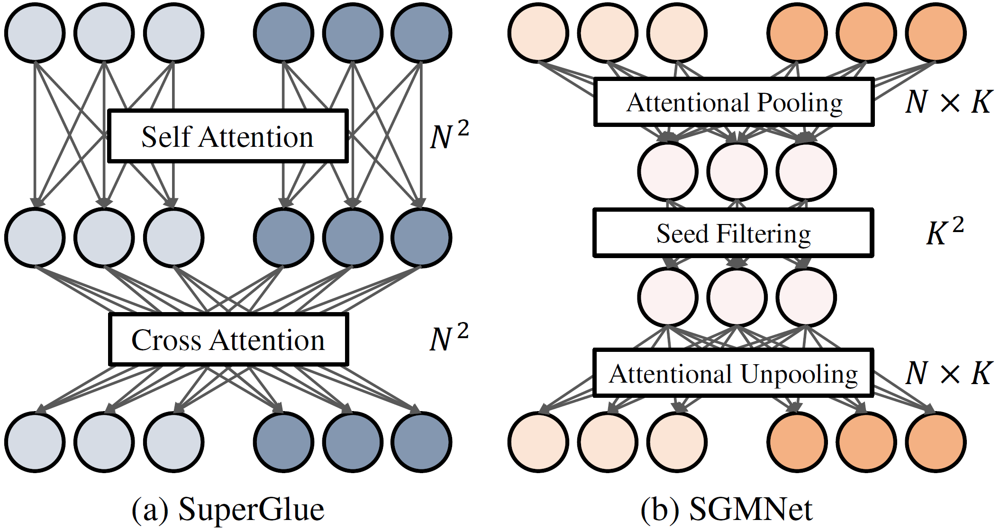

# SGMNet Implementation



PyTorch implementation of SGMNet for ICCV'21 paper ["Learning to Match Features with Seeded Graph Matching Network"](https://arxiv.org/abs/2108.08771), by Hongkai Chen, Zixin Luo, Jiahui Zhang, Lei Zhou, Xuyang Bai, Zeyu Hu, Chiew-Lan Tai, Long Quan.

This work focuses on keypoint-based image matching problem. We mitigate the qudratic complexity issue for typical GNN-based matching by leveraging a restrited set of pre-matched seeds. 

This repo contains training, evaluation and basic demo sripts used in our paper. As baseline, it also includes **our implementation** for [SuperGlue](https://arxiv.org/abs/1911.11763). If you find this project useful, please cite:

```
@article{chen2021sgmnet,
  title={Learning to Match Features with Seeded Graph Matching Network},
  author={Chen, Hongkai and Luo, Zixin and Zhang, Jiahui and Zhou, Lei and Bai, Xuyang and Hu, Zeyu and Tai, Chiew-Lan and Quan, Long},
  journal={International Conference on Computer Vision (ICCV)},
  year={2021}
}
```

Part of the code is borrowed or ported from 

[SuperPoint](https://github.com/magicleap/SuperPointPretrainedNetwork), for SuperPoint implementation, 

[SuperGlue](https://github.com/magicleap/SuperGluePretrainedNetwork), for SuperGlue implementation and exact auc computation,

[OANet](https://github.com/zjhthu/OANet), for training scheme,

[PointCN](https://github.com/vcg-uvic/learned-correspondence-release), for implementaion of PointCN block and geometric transformations,

[FM-Bench](https://github.com/JiawangBian/FM-Bench), for evaluation of fundamental matrix estimation.


Please also cite these works if you find the corresponding code useful. 


## Requirements

We use PyTorch 1.6, later version should also be compatible. Please refer to [requirements.txt](requirements.txt) for other dependencies.

If you are using conda, you may configure the environment as:

```bash
conda create --name sgmnet python=3.7 -y && \
pip install -r requirements.txt && \
conda activate sgmnet
```

## Get started

Clone the repo:
```bash
git clone https://github.com/vdvchen/SGMNet.git && \
```
download model weights from [here](https://drive.google.com/file/d/1Ca0WmKSSt2G6P7m8YAOlSAHEFar_TAWb/view?usp=sharing)  

extract weights by
```bash
tar -xvf weights.tar.gz
```

A quick demo for image matching can be called by:

```bash
cd demo && python demo.py --config_path configs/sgm_config.yaml
```
The resutls will be saved as **match.png** in demo folder. You may configure the matcher in corresponding yaml file.


## Evaluation


We demonstrate evaluation process with RootSIFT and SGMNet. Evaluation with other features/matchers can be conducted by configuring the corresponding yaml files.  

### 1. YFCC Evaluation 

Refer to [OANet](https://github.com/zjhthu/OANet) repo to download raw YFCC100M dataset


**Data Generation**
       
1. Configure **datadump/configs/yfcc_root.yaml** for the following entries

   **rawdata_dir**: path for yfcc rawdata  
   **feature_dump_dir**: dump path for extracted features  
   **dataset_dump_dir**: dump path for generated dataset  
   **extractor**: configuration for keypoint extractor (2k RootSIFT by default)  

2. Generate data by
   ```bash
   cd datadump
   python dump.py --config_path configs/yfcc_root.yaml
   ```
   An h5py data file will be generated under **dataset_dump_dir**, e.g. **yfcc_root_2000.hdf5**

**Evaluation**:

1. Configure **evaluation/configs/eval/yfcc_eval_sgm.yaml** for the following entries

   **reader.rawdata_dir**: path for yfcc_rawdata  
   **reader.dataset_dir**: path for generated h5py dataset file    
   **matcher**: configuration for sgmnet (we use the default setting)

2. To run evaluation,    
   ```bash
   cd evaluation
   python evaluate.py --config_path configs/eval/yfcc_eval_sgm.yaml
   ```

For 2k RootSIFT matching, similar results as below should be obtained,
```bash
auc th: [5 10 15 20 25 30]
approx auc: [0.634 0.729 0.783 0.818 0.843 0.861]
exact auc: [0.355 0.552 0.655 0.719 0.762 0.793]
mean match score: 17.06
mean precision: 86.08
```

### 2. ScanNet Evaluation

Download processed [ScanNet evaluation data](https://drive.google.com/file/d/14s-Ce8Vq7XedzKon8MZSB_Mz_iC6oFPy/view?usp=sharing).  


**Data Generation**
       
1. Configure **datadump/configs/scannet_root.yaml** for the following entries

   **rawdata_dir**: path for ScanNet raw data  
   **feature_dump_dir**: dump path for extracted features  
   **dataset_dump_dir**: dump path for generated dataset  
   **extractor**: configuration for keypoint extractor (2k RootSIFT by default)  

2. Generate data by
   ```bash
   cd datadump
   python dump.py --config_path configs/scannet_root.yaml
   ```
   An h5py data file will be generated under **dataset_dump_dir**, e.g. **scannet_root_2000.hdf5** 

**Evaluation**:

1. Configure **evaluation/configs/eval/scannet_eval_sgm.yaml** for the following entries

   **reader.rawdata_dir**: path for ScanNet evaluation data  
   **reader.dataset_dir**: path for generated h5py dataset file    
   **matcher**: configuration for sgmnet (we use the default setting)  

2. To run evaluation,  
   ```bash
   cd evaluation
   python evaluate.py --config_path configs/eval/scannet_eval_sgm.yaml
   ```

For 2k RootSIFT matching, similar results as below should be obtained,
```bash
auc th: [5 10 15 20 25 30]
approx auc: [0.322 0.427 0.493 0.541 0.577 0.606]
exact auc: [0.125 0.283 0.383 0.452 0.503 0.541]
mean match score: 8.79
mean precision: 45.54
```

### 3. FM-Bench Evaluation

Refer to [FM-Bench](https://github.com/JiawangBian/FM-Bench) repo to download raw FM-Bench dataset

**Data Generation**
       
1. Configure **datadump/configs/fmbench_root.yaml** for the following entries

   **rawdata_dir**: path for fmbench raw data  
   **feature_dump_dir**: dump path for extracted features  
   **dataset_dump_dir**: dump path for generated dataset  
   **extractor**: configuration for keypoint extractor (4k RootSIFT by default)  

2. Generate data by
   ```bash
   cd datadump
   python dump.py --config_path configs/fmbench_root.yaml
   ```
   An h5py data file will be generated under **dataset_dump_dir**, e.g. **fmbench_root_4000.hdf5** 

**Evaluation**:

1. Configure **evaluation/configs/eval/fm_eval_sgm.yaml** for the following entries

   **reader.rawdata_dir**: path for fmbench raw data  
   **reader.dataset_dir**: path for generated h5py dataset file    
   **matcher**: configuration for sgmnet (we use the default setting)   

2. To run evaluation,  
   ```bash
   cd evaluation
   python evaluate.py --config_path configs/eval/fm_eval_sgm.yaml
   ```

For 4k RootSIFT matching, similar results as below should be obtained,
```bash
CPC results:
F_recall:  0.617
precision:  0.7489
precision_post:  0.8399
num_corr:  663.838
num_corr_post:  284.455  

KITTI results:
F_recall:  0.911
precision:  0.9035133886251774
precision_post:  0.9837278538989989
num_corr:  1670.548
num_corr_post:  1121.902

TUM results:
F_recall:  0.666
precision:  0.6520260208250837
precision_post:  0.731507123852191
num_corr:  1650.579
num_corr_post:  941.846

Tanks_and_Temples results:
F_recall:  0.855
precision:  0.7452896681043316
precision_post:  0.8020184635328004
num_corr:  946.571
num_corr_post:  466.865
```

### 4. Run time and memory Evaluation

We provide a script to test run time and memory consumption, for a quick start, run  

```bash
cd evaluation
python eval_cost.py --matcher_name SGM  --config_path configs/cost/sgm_cost.yaml --num_kpt=4000
```
You may configure the matcher in corresponding yaml files.


## Visualization

For visualization of matching results on different dataset, add **--vis_folder** argument on evaluation command, e.g.

```bash
cd evaluation
python evaluate.py --config_path configs/eval/***.yaml --vis_folder visualization
```


## Training

We train both SGMNet and SuperGlue on [GL3D](https://github.com/lzx551402/GL3D) dataset. The training data is pre-generated in an offline manner, which yields about 400k pairs in total. 

To generate training/validation dataset

1. Download [GL3D](https://github.com/lzx551402/GL3D) rawdata 

2. Configure **datadump/configs/gl3d.yaml**. Some important entries are

   **rawdata_dir**: path for GL3D raw data  
   **feature_dump_dir**: path for extracted features  
   **dataset_dump_dir**: path for generated dataset  
   **pairs_per_seq**: number of pairs sampled for each sequence    
   **angle_th**: angle threshold for sampled pairs  
   **overlap_th**: common track threshold for sampled pairs  
   **extractor**: configuration for keypoint extractor  

3. dump dataset by
```bash
cd datadump
python dump.py --config_path configs/gl3d.yaml
```

Two parts of data will be generated. (1) Extracted features and keypoints will be placed under **feature_dump_dir** (2) Pairwise dataset will be placed under **dataset_dump_dir**.

4. After data generation, configure **train/train_sgm.sh** for necessary entries, including   
   **rawdata_path**: path for GL3D raw data  
   **desc_path**: path for extracted features  
   **dataset_path**: path for generated dataset  
   **desc_suffix**: suffix for keypoint files, _root_1000.hdf5 for 1k RootSIFT by default.  
   **log_base**: log directory for training     
  
5. run SGMNet training scripts by
```bash
bash train_sgm.sh
```

our training scripts support multi-gpu training, which can be enabled by configure **train/train_sgm.sh** for these entries

   **CUDA_VISIBLE_DEVICES**: id of gpus to be used   
   **nproc_per_node**: number of gpus to be used

run SuperGlue training scripts by

```bash
bash train_sg.sh
```
